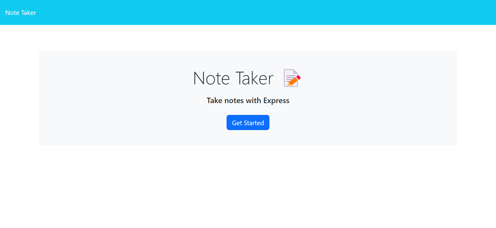
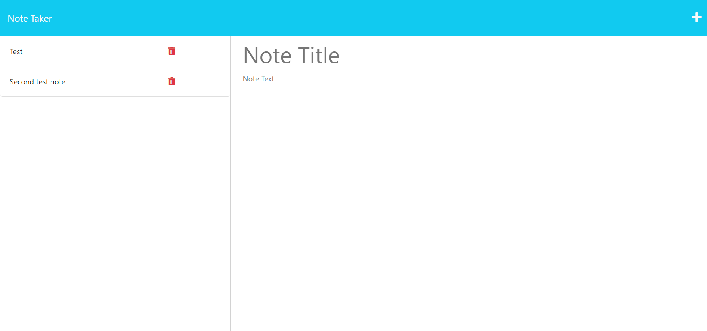

# CBC Week 11 Challenge: Notes Taker
## Description

This project is the ninth challenge assignment in the UC Berkeley Extension Full Stack Development Coding Bootcamp.  It is a note taker application that allows the user to create, view and delete notes.  The application uses an Express.js back end and saves and retrieves note data from a JSON file.

The major tasks for this project are:

- Create an Express.js app that uses HTTP GET, POST and DELETE requests.
- Use the fs module to read and write files.
- Deploy the application to Heroku.

## Table of Contents

- [Mock Up](#mock-up)
- [Final Product](#final-product)
- [Credits](#credits)
- [License](#license)
- [How to Contribute](#how-to-contribute)

## Mock Up
The frontend code was provided for this project.  Therefore, the mock up is the same as the final product.

## Final Product

The final product is deployed at https://agile-brook-75533.herokuapp.com/.

### Prerequisites

There are no prerequisites to run the application.  It runs via a Heroku instance.  However, if you want to run the application locally, you will need to install [Node.js](https://nodejs.org/en/).

### Usage Instructions

#### Running the Application Locally

To run the application locally, follow these steps:

1. Clone the repository to your local machine.
2. Open the repository in your preferred code editor.
3. From the root folder, run the command 'npm install' in your terminal to install dependencies.
4. From the root folder, run the command 'npm start' in your terminal to start the application.
5. Navigate to http://localhost:3001/ in your browser to view the application.

#### Running the Application on Heroku

To run the application deployed on Heroku, follow these steps:

1. Open the application in your browser at https://agile-brook-75533.herokuapp.com/.

### User Interface

The application opens up on a Getting Started page.  Clicking the "Get Started" button will navigate the user to the Notes page.  

<kbd> </kbd>

On the Notes page, the user can enter a note title and note text.  Clicking on the Save icon will save the note to the left-hand column.  The user can click on the note in the left-hand column to view the note.  The user can also click the plus icon to create a new note.  Finally, the user can click the trash can icon to delete a note.

<kbd> </kbd>

## Credits

### Resources

The below resources contributed to the project.

- UC Berkeley Extension provided the starter code for the project.  The helper functions, classes, middleware and routes were provided, as well as the frontend pages.

- [Heroku](https://www.heroku.com/) is a cloud platform as a service supporting several programming languages.  It is used to deploy the application.

- [Node.js](https://nodejs.org/en/) is a JavaScript runtime built on Chrome's V8 JavaScript engine.  The file system module is used to read and write files.

- [Express](https://expressjs.com/) is a Node.js web application framework.  It is used to serve the static files for the application.

### Collaborators

On this project, there was no peer review or collaboration.

## License

Refer to the LICENSE in the repository.

## How to Contribute

Contribute at https://github.com/JDempe/bootcamp-11-notes-taker.
